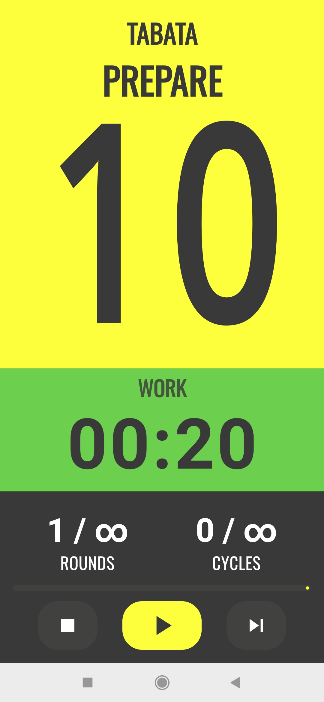
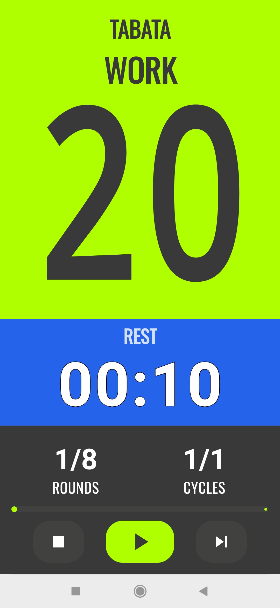
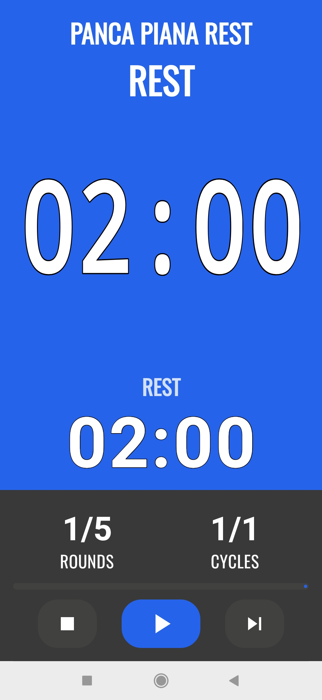
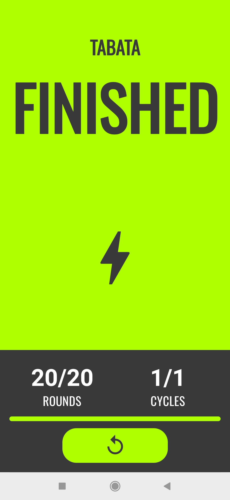
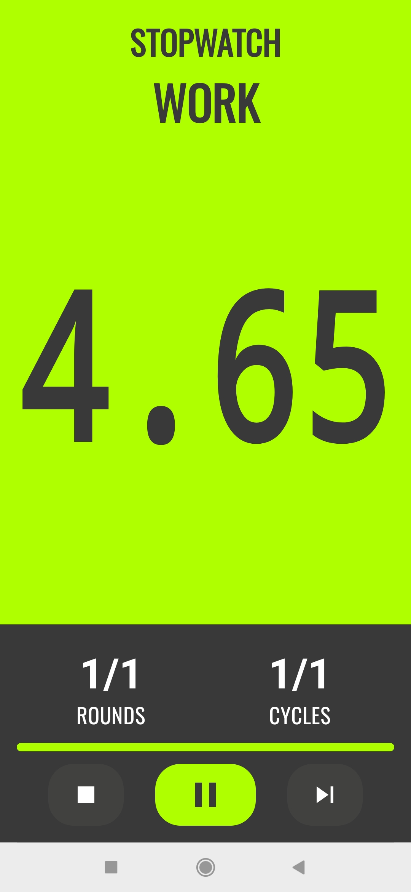
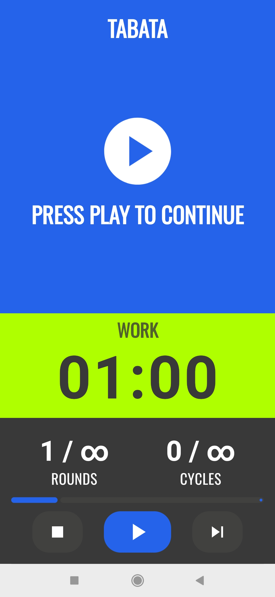
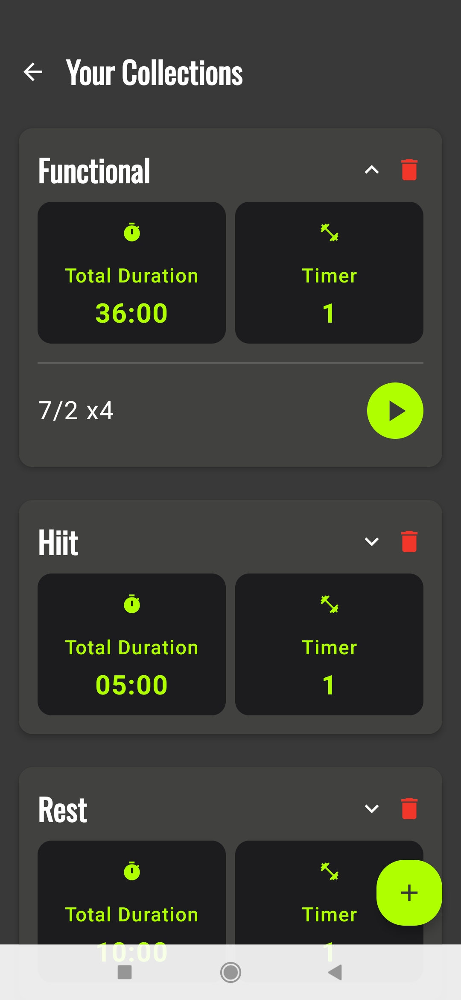
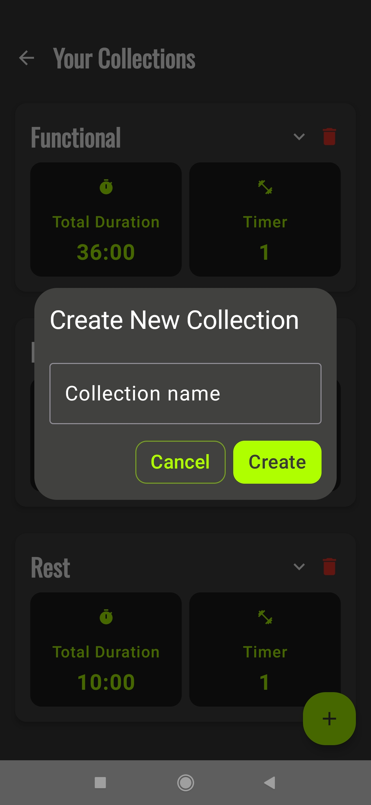

<!-- docs/en/index.md -->

# BlocksTimer User Manual

Welcome to BlocksTimer! This guide will help you discover all the app's features, from creating your first timer to advanced collection management.

[Passa alla versione in Italiano](../it/)

---

### Table of Contents
1. [Introduction: What is BlocksTimer For?](#1-introduction-what-is-blockstimer-for)
2. [The Main Screen and Its Features](#2-the-main-screen-and-its-features)
3. [Creating and Editing a Timer](#3-creating-and-editing-a-timer)
4. [Understanding Block Types](#4-understanding-block-types)
5. [Running a Timer: The Player](#5-running-a-timer-the-player)
6. [Organizing with Collections](#6-organizing-with-collections)
7. [Quick Settings (Options)](#7-quick-settings-options)

---

### 1. Introduction: What is BlocksTimer For?
BlocksTimer is an advanced interval timer designed to be flexible and powerful. Unlike traditional timers, it allows you to build complex sessions by assembling different "blocks," each with its own rules (work, rest, rounds, cycles, rest between cycles).

**Key Strengths:**
- **Modularity:** Build complex timers like time pyramids or multi-phase sessions.
- **Customization:** Assign a unique name and color to each timer to recognize it at a glance.
- **Organization:** Group your favorite timers into Collections (e.g., "Warm-ups," "HIIT," "Tabata").

---

### 2. The Main Screen and Its Features

This is the app's main screen, your command center for all the timers you've created. From here, you can view, start, organize, and manage every session.

#### The Side Menu: The Heart of Navigation

By tapping the gear icon (⚙️) in the top-left corner, you open the app's main navigation menu, from which you can access all major sections.

From the menu, you can access:
-   **Your Collections:** Takes you to the screen dedicated to managing your timer groups.
-   **Help & Features:** Opens this guide to help you get the most out of the app.
-   **Options:** Allows you to access the app's global settings, described in detail in the [Quick Settings](#7-quick-settings-options) chapter.

#### The Timer List

The central area of the main screen displays the cards for all your saved timers. You can use the **Filters** at the top ("All," "Functional," "Hiit," etc.) to display only the timers belonging to a specific collection.

#### Interacting with a Timer

Each timer in the list is an interactive card:

-   **Quick Start (▶️):** Press the large green button to start the timer immediately.
-   **Options Menu (⋮):** Opens a context menu with three options:
    -   **Edit:** Takes you back to the editor to change the timer's name, color, and blocks.
    -   **Associate:** Opens a dialog to link the timer to your collections.
    -   **Delete:** Starts the secure deletion process via a slide-to-confirm action.

---

### 3. Creating and Editing a Timer

Creating a new timer is a guided and intuitive process. Let's go through the steps one by one.

#### Step 1: Getting Started
If you haven't created any timers yet, you'll see the initial screen. Press the **"+ Add Timer"** button to begin. If you already have timers, you can use the **"+"** button in the top-right corner of the main screen.

#### Step 2: Naming and Coloring
The first thing to do is give your timer an identity.
1.  **Write a descriptive name** (e.g., "Intense Tabata").
2.  **Choose a color** from the palette to easily recognize it in the list.
3.  Press **"Confirm"**.

#### Step 3: Adding the First Block
You are now in the timer editor. It's initially empty. Press **"+ Add Block"** to open the dialog and create your first block.

In the dialog, you can define all your block's parameters: work duration, rest duration, number of Rounds, and Cycles. Press **"Save"** to add it to your timer.

#### Step 4: Building the Sequence
Once the first block is added, it will appear in the editor. You can continue adding more blocks to create complex sequences. For example, after a Tabata block, you could add a Manual Pause.

Continue adding all the necessary blocks to complete your timer.

#### Step 5: Modifying the Sequence
Each block you add has its own controls:
- **Ordering:** Use the **up (🔼) and down (🔽) arrows** on each block to change its position in the sequence.
- **Editing:** Click anywhere on the block's card to reopen the dialog and modify its parameters.
- **Deletion:** Use the **trash can icon (🗑️)** to delete a block.

#### Step 6: Finalize
When you are satisfied with the sequence, press the **"Finish"** button at the bottom of the screen to save the timer and return to the main list.

---

### 4. Understanding Block Types

BlocksTimer allows you to use three different types of blocks for maximum flexibility, all accessible from the "Add Block" dialog.

#### Intervals

This is the standard and most powerful block, ideal for most interval training like HIIT, Tabata, or strength sessions. It allows for detailed configuration of every aspect:

-   **Work:** The duration of the effort phase.
-   **Rest:** The recovery duration after each work phase.
-   **Rounds:** The number of times the Work/Rest sequence is repeated.
-   **Cycles:** The number of times the entire set of rounds is repeated. Useful for creating "super-sets."
-   **Rest between cycles:** A longer recovery time that activates only at the end of each cycle (except the last one).

> **⭐ ADVANCED FEATURE: Infinite Rounds and Cycles**
> By setting **Rounds** or **Cycles** to **0**, you will create a sequence that repeats forever. The timer will not stop on its own. This feature is perfect for training to failure or when you want to decide when to move to the next block by pressing the "Skip" button.

#### Stopwatch

By selecting "Stopwatch," the block transforms into a simple count-up timer (00:00, 00:01, 00:02...). It has no predefined duration.

-   **Ideal for:** "AMRAP" (As Many Rounds As Possible) or "For Time" workouts, where the goal is to complete a task in the shortest time possible.
-   **How it works:** The stopwatch will continue counting up until you press the "Skip" button to move to the next block or end the timer.

#### Manual Pause

This is a special block that pauses the timer's flow indefinitely.

-   **Ideal for:** Inserting untimed breaks, changing equipment, moving to another workout area, or simply catching your breath before the next phase.
-   **How it works:** When the timer reaches a Manual Pause block, it stops and waits for you to press the "Play" button to resume with the next block.

---

### 5. Running a Timer: The Player

Once a timer is started, you enter the Player screen, designed to be clear and readable even during the most intense workouts. The interface changes color and layout depending on the current phase.

#### Timer Phases

1.  **Prepare:** An initial 10-second countdown (yellow) gives you time to get ready before the first work phase begins. At the bottom, you can see a preview of the next block.
    

2.  **Work:** This is the active phase of your workout (green). The main display shows the remaining time.
    

3.  **Rest:** The recovery phase (blue). Here too, you can see a preview of the next phase at the bottom.
    

4.  **Finished:** Upon completion of all blocks, the timer displays an end screen (green), and the only available control is the "Restart" button.
    

#### Player Controls

At the bottom of the screen, you'll find the main controls:

-   **Pause/Resume (❚❚ / ▶):** Pauses the timer or resumes it from where it left off.
-   **Stop (■):** Completely stops the timer and takes you back to the main list.
-   **Skip (►►):** Immediately jumps to the next phase in the sequence.

#### Real-Time Stats

Below the time display, you can track your progress:

-   **Rounds:** Shows the current round versus the total (e.g., `1/8`).
-   **Cycles:** Shows the current cycle versus the total (e.g., `1/1`).
-   **Progress Bar:** Visually indicates how far you are through the entire timer.

#### Special Player Features

-   **Stopwatch:** When a block is a Stopwatch type, the time counts up and shows hundredths of a second for greater precision.
    

-   **Manual Pause:** When the timer reaches a Manual Pause block, the interface prompts you to press "Play" to continue, giving you all the time you need.
    

-   **Infinite Timer (∞):** If you have set rounds or cycles to 0, the counter will display the infinity symbol (∞), indicating that the sequence will repeat until you stop or skip it.

---

### 6. Organizing with Collections

Collections are like folders for your timers. They allow you to group your sessions by workout type (e.g., "HIIT," "Warm-up," "Strength"), keeping your main list always tidy and easy to browse.

#### The Collections Screen

You can access this section from the side menu by selecting "Your Collections." Here you can manage all your groupings.

On this screen you can:

-   **Expand and Collapse (🔼/🔽):** Use the arrows to show or hide the timers contained in a collection.
-   **Start a Timer:** When a collection is expanded, you can start a timer directly by pressing the Play button (▶️) next to its name.
-   **View Stats:** Each collection shows the total duration of all its timers and the number of timers it contains.
-   **Delete a Collection (🗑️):** The trash can icon allows you to delete an entire collection. **Note:** this does not delete the timers inside it, only the grouping. The timers will remain visible in the "All" list.

#### Create a New Collection

To create a new collection, press the floating **"+"** button in the bottom right. A dialog will appear where you can enter the name of the new collection (e.g., "Yoga," "Light Cardio"). Press "Create" to save it.

#### Associate a Timer with a Collection

The most powerful way to use collections is to associate your existing timers. This is done from the **main timer list screen**:

1.  Go to the timer list.
2.  Find the timer you want to organize and press the three-dot menu (⋮).
3.  Select the **"Associate"** option.
4.  In the window that appears, check the boxes of all the collections you want to add the timer to. You can associate a timer with multiple collections at once.
5.  Press **"DONE"** to confirm.

Once associated, the timer will appear in both the "All" list and under the filters of the chosen collections.

---

### 7. Quick Settings (Options)

From the side menu, by selecting "Options," you can access the application's quick settings. These options apply globally to all timers.

-   **Display:** By enabling this option, your device's screen will remain on during a timer's execution. This is very useful to prevent the phone from locking in the middle of a session.
-   **Sound:** This switch allows you to enable or disable all app sounds, including start/end phase beeps and countdown alerts.