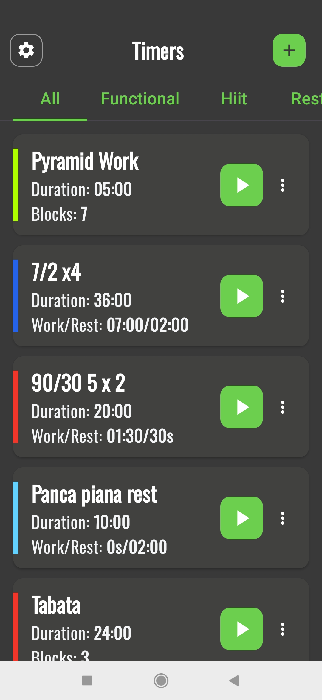
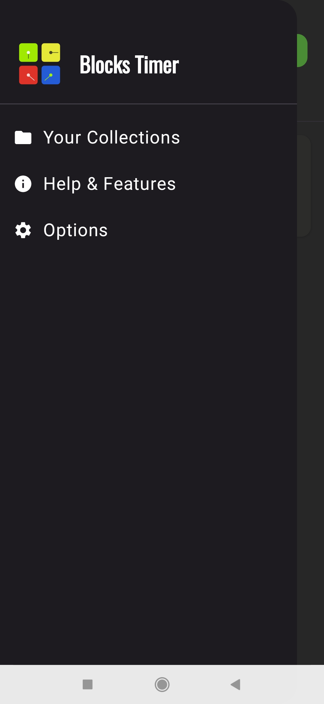
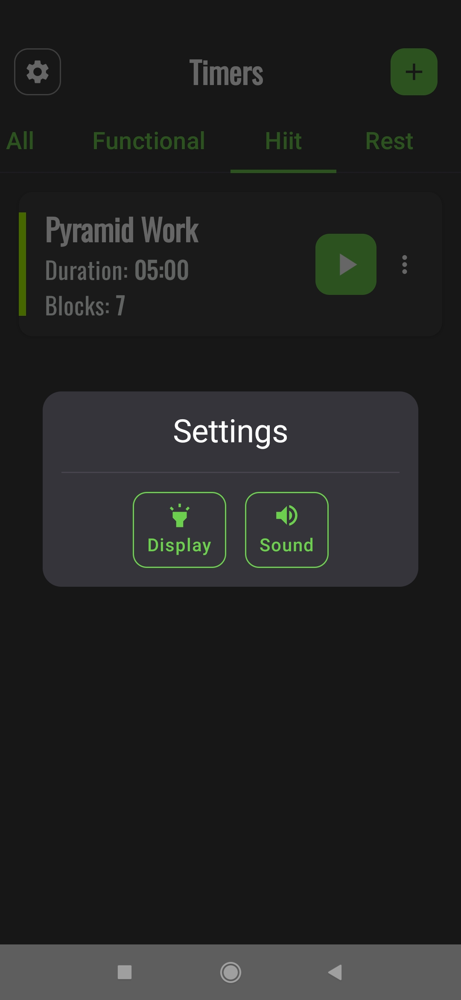
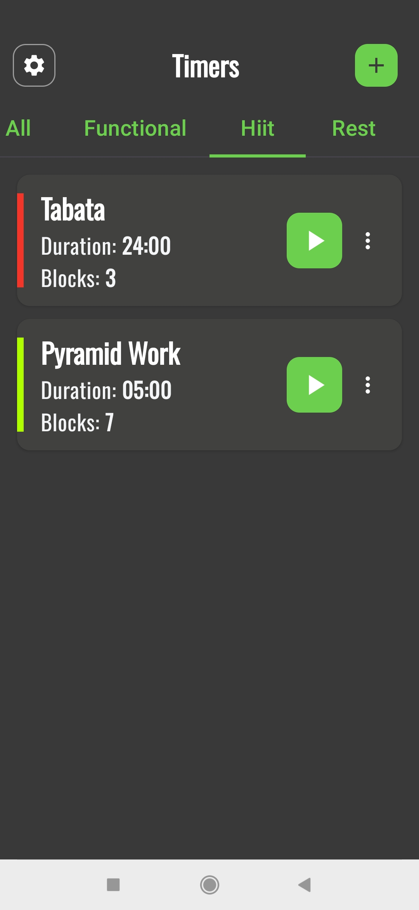
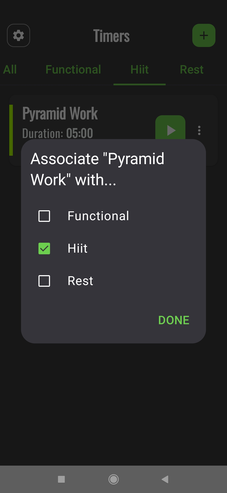
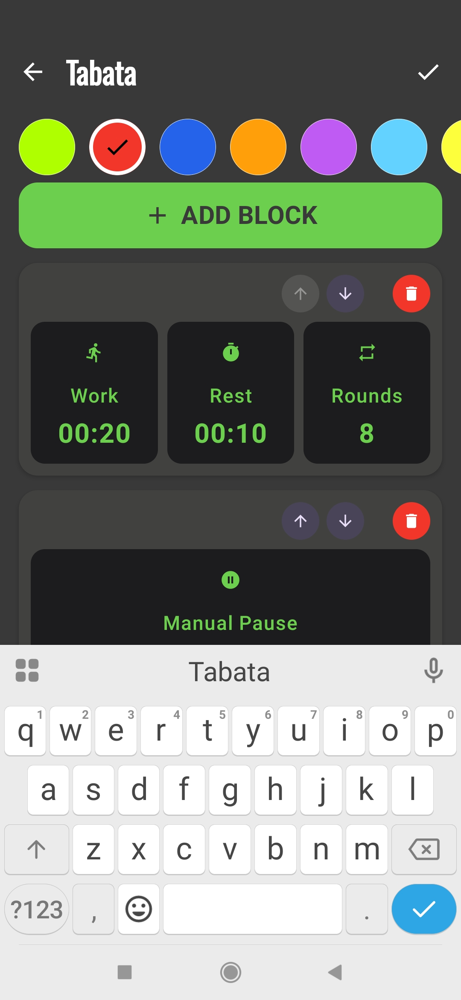
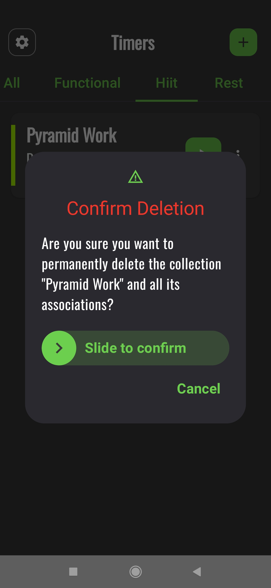

<!-- docs/it/index.md -->

# Manuale Utente di BlocksTimer

Benvenuto in BlocksTimer! Questa guida ti aiuterà a scoprire tutte le funzionalità dell'app, dalla creazione del tuo primo timer alla gestione avanzata delle collezioni.

[Switch to English version](../en/)

---

### Indice
1. [Introduzione: A Cosa Serve BlocksTimer?](#1-introduzione)
2. [La Schermata Principale: La Lista dei timer](#2-la-schermata-principale)
3. [Creare e Modificare un timer](#3-creare-e-modificare-un-timer)
4. [I Tipi di Blocco](#4-i-tipi-di-blocco)
5. [Eseguire un Allenamento: Il Player](#5-eseguire-un-allenamento)
6. [Organizzare con le Collezioni](#6-organizzare-con-le-collezioni)
7. [Impostazioni Rapide](#7-impostazioni-rapide)

---

### 1. Introduzione: A Cosa Serve BlocksTimer?
BlocksTimer è un timer a intervalli avanzato, progettato per essere flessibile e potente. A differenza dei timer tradizionali, ti permette di costruire allenamenti complessi assemblando diversi "blocchi", ognuno con le sue regole (lavoro, riposo, round, cicli, recupero tra i cicli).

**Pregi principali:**
- **Modularità:** Costruisci allenamenti complessi come piramidi di tempo o sessioni multi-fase.
- **Personalizzazione:** Assegna un nome e un colore a ogni timer per riconoscerlo al volo.
- **Organizzazione:** Raggruppa i tuoi timer preferiti in Collezioni (es. "Riscaldamento", "HIIT", "Tabata").

### 2. La Schermata Principale e le Sue Funzioni

Questa è la schermata principale dell'app, il tuo centro di comando per tutti i timer che hai creato. Da qui puoi visualizzare, avviare, organizzare e gestire ogni tua sessione.

#### Il Menu Laterale: Il Cuore della Navigazione

Toccando l'icona a forma di ingranaggio (⚙️) in alto a sinistra, apri il menu di navigazione principale dell'app.

Da qui puoi accedere a tre sezioni chiave:

1.  **Your Collections:** Ti porta alla schermata dedicata alla gestione delle tue collezioni.
2.  **Help & Features:** Apre questa guida per aiutarti a usare l'app al meglio.
3.  **Options:** Mostra una finestra di dialogo con le impostazioni rapide dell'applicazione.

Vediamo in dettaglio le **Options**:

#### Impostazioni Rapide (Options)

Questa finestra ti permette di controllare due impostazioni globali importanti:

-   **Display:** Attivando questa opzione, lo schermo del tuo dispositivo rimarrà sempre acceso durante l'esecuzione di un timer, evitando che si blocchi nel mezzo di una sessione.
-   **Sound:** Controlla tutti i suoni dell'app, inclusi i segnali acustici di inizio/fine fase e i bip del conto alla rovescia.

#### La Lista dei Timer

L'area centrale della schermata principale mostra le card di tutti i tuoi timer salvati. Puoi usare i **Filtri** in alto ("All", "Functional", "Hiit", etc.) per visualizzare solo i timer appartenenti a una specifica collezione.

#### Interagire con un Timer

Ogni timer nella lista è una card interattiva:

-   **Avvio Rapido (▶️):** Premi il grande pulsante verde per avviare immediatamente il timer.
-   **Menu Opzioni (⋮):** Apre un menu contestuale con tre opzioni:
    -   **Edit (Modifica):** Ti riporta all'editor per modificare nome, colore e blocchi del timer.
    -   **Associate (Associa):** Apre una finestra per collegare il timer alle tue collezioni.
    -   **Delete (Elimina):** Avvia la procedura di cancellazione sicura del timer tramite scorrimento.

#### Panoramica della Schermata

1.  **Pulsante Impostazioni (⚙️):** In alto a sinistra, ti dà accesso alle opzioni rapide dell'app come "Mantieni Schermo Acceso" e "Suono".
2.  **Pulsante Aggiungi (+):** In alto a destra, ti permette di avviare il processo di creazione di un nuovo timer.
3.  **Lista dei Timer:** L'area centrale dove vengono mostrate le card di tutti i tuoi timer salvati.
4.  **Filtri per Collezione:** Le linguette in alto ("All", "Functional", "Hiit", etc.) ti permettono di filtrare la lista per visualizzare solo i timer appartenenti a una specifica collezione.

#### Filtrare per Collezione

Toccando il nome di una collezione (es. "Hiit"), la lista mostrerà istantaneamente solo i timer che hai associato a quella categoria, aiutandoti a trovare subito quello che cerchi.

#### Interagire con un Timer

Ogni timer nella lista è una card interattiva con diverse opzioni:

-   **Avvio Rapido (▶️):** Premi il grande pulsante verde per avviare immediatamente il timer.
-   **Menu Opzioni (⋮):** Il menu con i tre puntini verticali ti dà accesso alle funzioni di gestione avanzate.

Vediamo le opzioni del menu in dettaglio:

-   **Modifica:** Selezionando "Edit" (Modifica), verrai riportato alla schermata dell'editor del timer, dove potrai cambiare il nome, il colore e aggiungere, rimuovere o riordinare i blocchi.
    

-   **Associa a Collezioni:** Questa opzione apre una finestra di dialogo dove puoi facilmente collegare o scollegare il timer a una o più collezioni. Basta spuntare le caselle desiderate e premere "DONE".
    

-   **Elimina:** Per cancellare un timer in modo sicuro, l'app ti chiederà una conferma. Per evitare eliminazioni accidentali, dovrai scorrere il dito sul pulsante "Slide to confirm".
    

Questa schermata è progettata per darti un accesso rapido e completo a tutte le funzionalità principali dell'app.

---

### 3. Creare e Modificare un timer

Creare un nuovo timer è un processo guidato e intuitivo. Vediamo i passaggi uno per uno.

#### Passo 1: Iniziare
Se non hai ancora creato nessun timer, vedrai la schermata iniziale. Premi il pulsante **"+ Add Timer"** per cominciare. Se hai già dei timer, puoi usare il pulsante **"+"** in alto a destra nella schermata principale.

#### Passo 2: Dare un Nome e un Colore
La prima cosa da fare è dare un'identità al tuo allenamento.
1.  **Scrivi un nome** descrittivo (es. "Tabata Intenso").
2.  **Scegli un colore** dalla palette per riconoscerlo facilmente nella lista.
3.  Premi **"Conferma"**.

#### Passo 3: Aggiungere il Primo Blocco
Ora sei nell'editor del timer. Inizialmente è vuoto. Premi **"+ Add Block"** per aprire la finestra di dialogo e creare il tuo primo blocco di allenamento.

Nella finestra di dialogo, puoi definire tutti i parametri del tuo blocco: durata del lavoro (Work), del riposo (Rest), numero di Round e Cicli. Premi **"Save"** per aggiungerlo al tuo timer.

#### Passo 4: Costruire la Sequenza
Una volta aggiunto il primo blocco, questo apparirà nell'editor. Puoi continuare ad aggiungere altri blocchi per creare sequenze complesse. Ad esempio, dopo un blocco Tabata, potresti aggiungere una Pausa Manuale.

Continua ad aggiungere tutti i blocchi necessari per completare il tuo allenamento.

#### Passo 5: Modificare la Sequenza
Ogni blocco che aggiungi ha i suoi controlli:
- **Ordinamento:** Usa le **frecce su (🔼) e giù (🔽)** su ogni blocco per cambiarne la posizione nella sequenza.
- **Modifica:** Clicca in un punto qualsiasi della card del blocco per riaprire la finestra di dialogo e modificarne i parametri.
- **Eliminazione:** Usa l'**icona del cestino (🗑️)** per eliminare un blocco.

#### Passo 6: Finalizzare
Quando sei soddisfatto della sequenza, premi il pulsante **"Finish"** in fondo alla schermata per salvare il timer e tornare alla lista principale.

---

### 4. I Tipi di Blocco
BlocksTimer ti permette di usare tre tipi di blocchi diversi per la massima flessibilità.

- **Intervals (Predefinito):** È il blocco standard. Qui puoi impostare tempi di **Work**, **Rest**, **Rounds** (il numero di volte che la sequenza Lavoro/Riposo viene ripetuta) e **Cycles** (il numero di volte che l'intero set di round viene ripetuto), con la possibilità di aggiungere un recupero tra un ciclo e l'altro.

- **Stopwatch (Contatore):** Un semplice cronometro che conta il tempo verso l'alto. È ideale per allenamenti "AMRAP" (As Many Rounds As Possible) o "For Time", dove l'obiettivo è completare un certo lavoro nel minor tempo possibile.

- **Manual Pause (Pausa Manuale):** Questo blocco speciale mette in pausa il timer e attende un tuo comando per ripartire. È perfetto per inserire pause non cronometrate, per cambiare attrezzi o per prendere fiato prima della fase successiva.

---

### 5. Eseguire un Allenamento: Il Player
*... Contenuto da aggiungere ...*

### 6. Organizzare con le Collezioni
*... Contenuto da aggiungere ...*

### 7. Impostazioni Rapide
*... Contenuto da aggiungere ...*