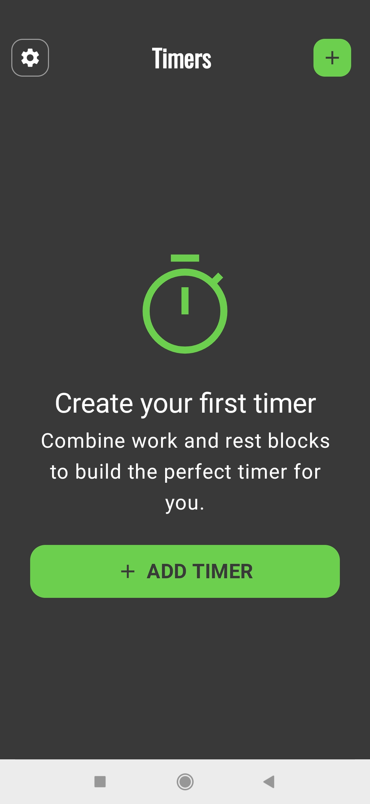
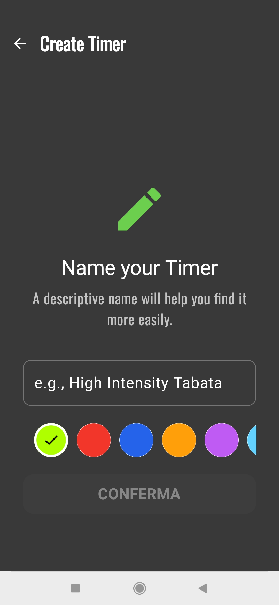
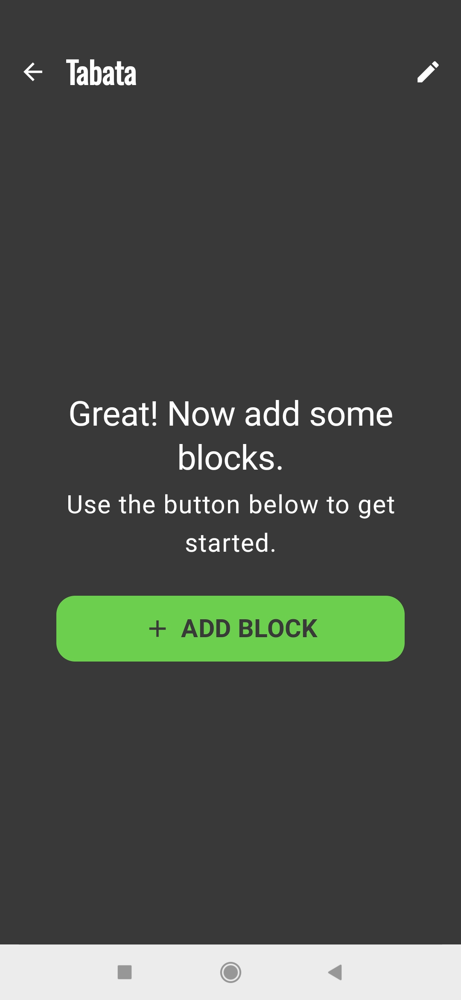
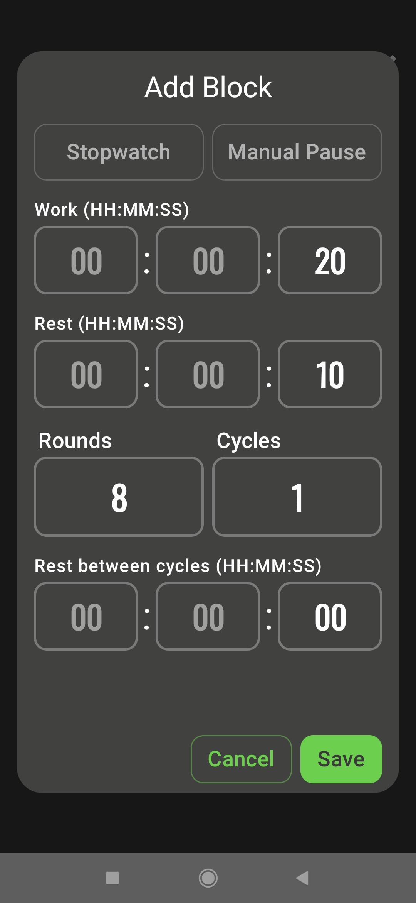
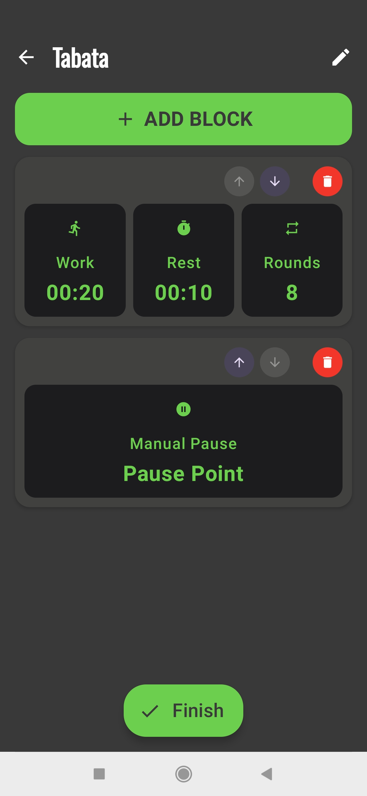
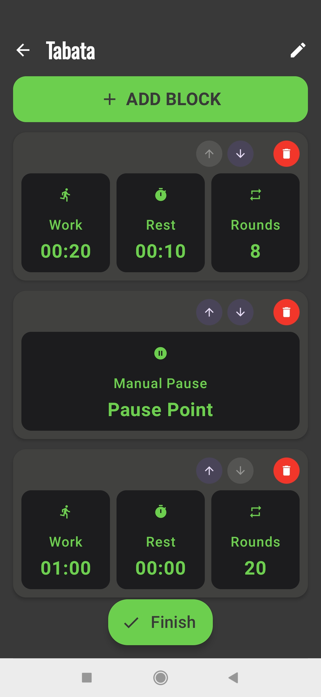
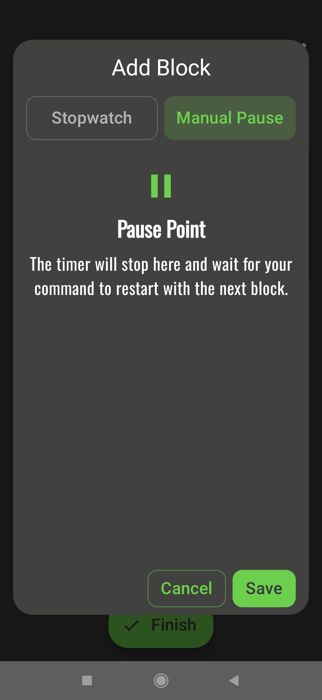

<!-- docs/it/index.md -->

# Manuale Utente di BlocksTimer

Benvenuto in BlocksTimer! Questa guida ti aiuterà a scoprire tutte le funzionalità dell'app, dalla creazione del tuo primo workout alla gestione avanzata delle collezioni.

[Switch to English version](../en/)

---

### Indice
1. [Introduzione: A Cosa Serve BlocksTimer?](#1-introduzione)
2. [La Schermata Principale: La Lista dei Workout](#2-la-schermata-principale)
3. [Creare e Modificare un Workout](#3-creare-e-modificare-un-workout)
4. [I Tipi di Blocco](#4-i-tipi-di-blocco)
5. [Eseguire un Allenamento: Il Player](#5-eseguire-un-allenamento)
6. [Organizzare con le Collezioni](#6-organizzare-con-le-collezioni)
7. [Impostazioni Rapide](#7-impostazioni-rapide)

---

### 1. Introduzione: A Cosa Serve BlocksTimer?
BlocksTimer è un timer a intervalli avanzato, progettato per essere flessibile e potente. A differenza dei timer tradizionali, ti permette di costruire allenamenti complessi assemblando diversi "blocchi", ognuno con le sue regole (lavoro, riposo, round, cicli).

**Pregi principali:**
- **Modularità:** Costruisci allenamenti complessi come piramidi di tempo o sessioni multi-fase.
- **Personalizzazione:** Assegna un nome e un colore a ogni workout per riconoscerlo al volo.
- **Organizzazione:** Raggruppa i tuoi workout preferiti in Collezioni (es. "Riscaldamento", "HIIT", "Tabata").

### 2. La Schermata Principale: La Lista dei Workout
*... Contenuto da aggiungere ...*

---

### 3. Creare e Modificare un Workout

Creare un nuovo workout è un processo guidato e intuitivo. Vediamo i passaggi uno per uno.

#### Passo 1: Iniziare
Se non hai ancora creato nessun timer, vedrai la schermata iniziale. Premi il pulsante **"+ Add Timer"** per cominciare. Se hai già dei workout, puoi usare il pulsante **"+"** in alto a destra nella schermata principale.

#### Passo 2: Dare un Nome e un Colore
La prima cosa da fare è dare un'identità al tuo allenamento.
1.  **Scrivi un nome** descrittivo (es. "Tabata Intenso").
2.  **Scegli un colore** dalla palette per riconoscerlo facilmente nella lista.
3.  Premi **"Conferma"**.

#### Passo 3: Aggiungere il Primo Blocco
Ora sei nell'editor del workout. Inizialmente è vuoto. Premi **"+ Add Block"** per aprire la finestra di dialogo e creare il tuo primo blocco di allenamento.

Nella finestra di dialogo, puoi definire tutti i parametri del tuo blocco: durata del lavoro (Work), del riposo (Rest), numero di Round e Cicli. Premi **"Save"** per aggiungerlo al tuo workout.

#### Passo 4: Costruire la Sequenza
Una volta aggiunto il primo blocco, questo apparirà nell'editor. Puoi continuare ad aggiungere altri blocchi per creare sequenze complesse. Ad esempio, dopo un blocco Tabata, potresti aggiungere una Pausa Manuale.

Continua ad aggiungere tutti i blocchi necessari per completare il tuo allenamento.

#### Passo 5: Modificare la Sequenza
Ogni blocco che aggiungi ha i suoi controlli:
- **Ordinamento:** Usa le **frecce su (🔼) e giù (🔽)** su ogni blocco per cambiarne la posizione nella sequenza.
- **Modifica:** Clicca in un punto qualsiasi della card del blocco per riaprire la finestra di dialogo e modificarne i parametri.
- **Eliminazione:** Usa l'**icona del cestino (🗑️)** per eliminare un blocco.

#### Passo 6: Finalizzare
Quando sei soddisfatto della sequenza, premi il pulsante **"Finish"** in fondo alla schermata per salvare il workout e tornare alla lista principale.

---

### 4. I Tipi di Blocco
BlocksTimer ti permette di usare tre tipi di blocchi diversi per la massima flessibilità.

- **Intervals (Predefinito):** È il blocco standard. Qui puoi impostare tempi di **Work**, **Rest**, **Rounds** (il numero di volte che la sequenza Lavoro/Riposo viene ripetuta) e **Cycles** (il numero di volte che l'intero set di round viene ripetuto), con la possibilità di aggiungere un recupero tra un ciclo e l'altro.

- **Stopwatch (Contatore):** Un semplice cronometro che conta il tempo verso l'alto. È ideale per allenamenti "AMRAP" (As Many Rounds As Possible) o "For Time", dove l'obiettivo è completare un certo lavoro nel minor tempo possibile.

- **Manual Pause (Pausa Manuale):** Questo blocco speciale mette in pausa il timer e attende un tuo comando per ripartire. È perfetto per inserire pause non cronometrate, per cambiare attrezzi o per prendere fiato prima della fase successiva.

---

### 5. Eseguire un Allenamento: Il Player
*... Contenuto da aggiungere ...*

### 6. Organizzare con le Collezioni
*... Contenuto da aggiungere ...*

### 7. Impostazioni Rapide
*... Contenuto da aggiungere ...*